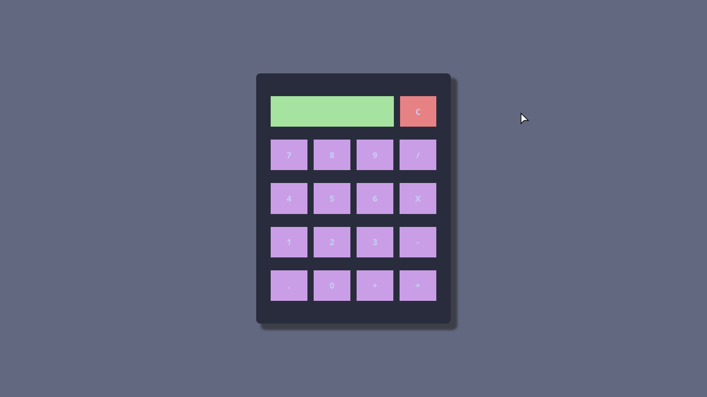

# 🧮 Odin Calculator App

A simple and functional calculator built as part of [The Odin Project](https://www.theodinproject.com/) curriculum.  
This project helped me practice **JavaScript fundamentals, DOM manipulation, and clean UI design**.

---

## 🚀 Features
- Basic arithmetic operations: **add, subtract, multiply, divide**
- Clear button (**C**) to reset the calculator
- Displays both the **current input** and the **full expression**
- Handles multiple-digit numbers
- Simple and **minimalist UI design**

---

## 🛠️ Built With
- **HTML5** – structure of the app  
- **CSS3** – layout & styling (dark mode style with pastel buttons)  
- **JavaScript (ES6)** – calculator logic & DOM updates  

---

## 📸 Screenshot


---

## 📂 Project Structure

---
```
odin-calculator-app/
│── index.html # Main HTML file
│── styles.css # Styling for the calculator
│── calculator.js # JavaScript logic
└── README.md # Project documentation

```
---

## 🎯 What I Learned
- How to **separate logic and UI updates** in JavaScript  
- Using **event listeners** for interactive buttons  
- Handling **edge cases** like number length and display overflow  
- Keeping the UI **minimal, clear, and user-friendly**

---

## 🚧 Future Improvements
- Implement **keyboard input support**  
- Add **hover/press animations** for better UX  

---

## 💡 Personal Note
This project reflects my **minimalist mindset** as a developer — I like things that are clean, functional, and easy to use.  
It also shows how I build step by step: start with functionality, refine with design, and then polish the details.  

---


